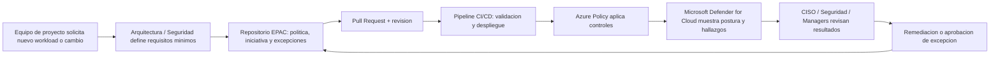
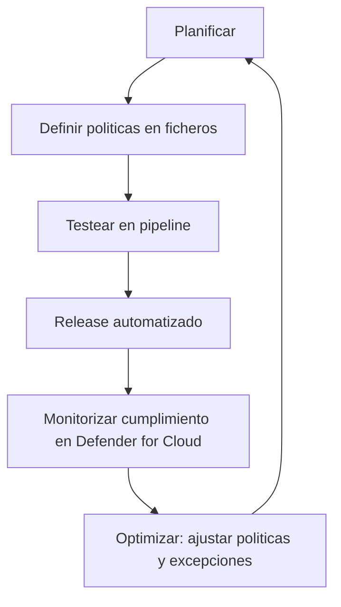

# Presentacion Ejecutiva EPAC (HTML)

Archivo principal: `index.html` (indice de webcasts)

## Estructura actual

- `index.html`: portada de navegacion (selector de webcast)
- `webcast-1-ejecutivo.html`: sesion ejecutiva/empresarial
- `webcast-2-tecnico.html`: sesion tecnica con detalle + demo

## Como usar

1. Abre `index.html` en el navegador.
2. Selecciona el webcast que quieras abrir.
3. Dentro de cada webcast, navega con flechas (`←` `→`) o botones en pantalla.
4. Para exportar a PDF: `Ctrl + P` y guardar como PDF.

## Estructura de la narrativa (15 min)

- Portada y mensaje clave
- Agenda
- Presentacion personal (placeholder)
- Problema de negocio
- Que es EPAC
- Valor para negocio
- Gobierno con Azure Policy + Defender for Cloud
- Agilidad, IA y automatizacion con GitHub Actions / Azure DevOps
- Caso practico rapido (antes vs despues)
- Cierre y plan de 90 dias

## Personalizacion rapida

- Completa los placeholders de la slide "Quien soy".
- Ajusta textos por sector o cliente.
- Si quieres branding corporativo, cambia variables CSS en `:root`.

## Flujo EPAC (solicitud a resultado)

Resumen ejecutivo:
- Arranque rapido: baseline inicial en 1 semana.
- Control continuo: politicas aplicadas y medibles desde el portal de Azure.
- Escalado por demanda: mas politicas, mas automatizacion y mayor cobertura segun necesidad del cliente.

## Ciclo continuo de gobierno

## Mini guion para explicarlo en 20-30 segundos

"Un equipo pide un nuevo despliegue. EPAC traduce los requisitos de seguridad en politicas como codigo, las valida en pipeline y las aplica automaticamente con Azure Policy. El resultado lo ven CISO y equipos de seguridad en Microsoft Defender for Cloud, con evidencia continua para decidir remediacion o excepciones de forma controlada."

## Despliegue automatico en GitHub Pages

Ya incluido en el repositorio:
- Workflow: `.github/workflows/deploy-pages.yml`
- Soporte estatico: `.nojekyll`

Como activarlo (una sola vez):
1. Sube estos cambios a la rama `main`.
2. En GitHub, entra en `Settings > Pages`.
3. En `Source`, selecciona `GitHub Actions`.

Desde ese momento:
- Cada push a `main` despliega automaticamente la web.
- La URL final suele ser `https://<usuario>.github.io/<repositorio>/`.
